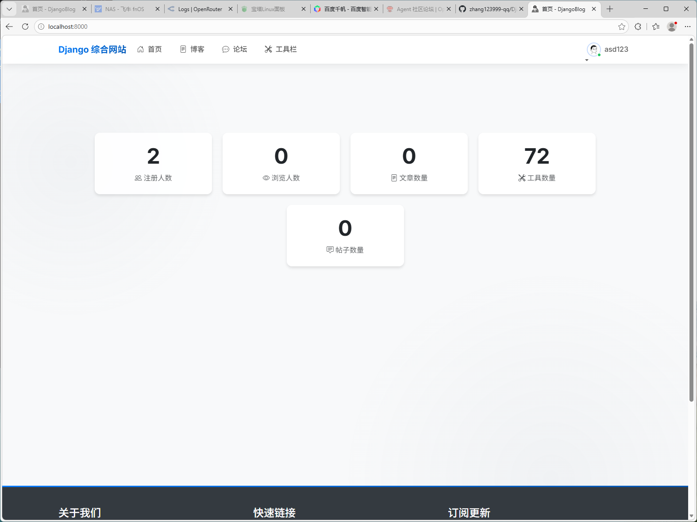
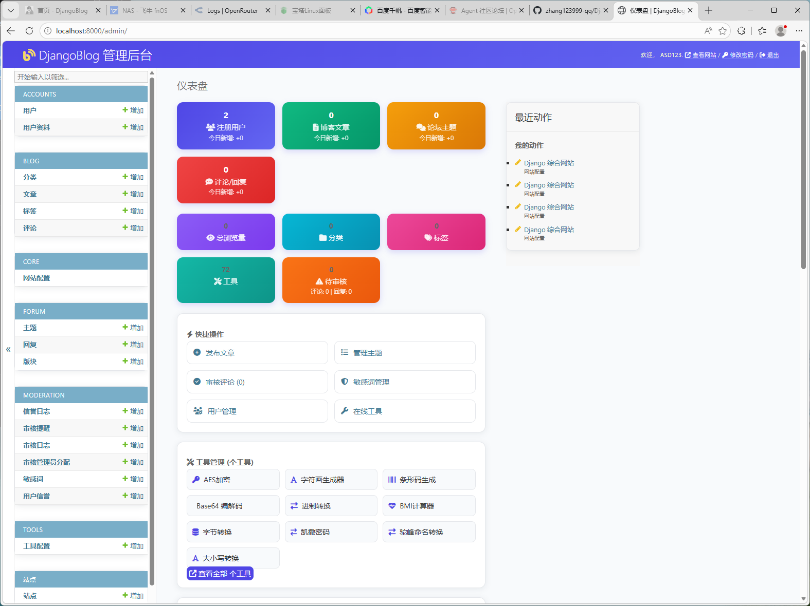

# DjangoBlog

<div align="center">


一个面向生产部署的 Django 综合站点：**博客 + 论坛 + 工具箱 + API**。  
强调「可用性、可维护性、可部署性」，适合个人站点、中小团队内容平台与教学演示。

[在线演示](#) · [快速开始](#-快速开始) · [API 文档](./docs/API.md) · [贡献指南](./CONTRIBUTING.md)

</div>

---

## 目录

- [项目亮点](#-项目亮点)
- [项目截图](#-项目截图)
- [技术栈](#-技术栈)
- [项目结构](#-项目结构)
- [快速开始](#-快速开始)
  - [一键自动部署（推荐）](#一键自动部署推荐)
  - [手动分步部署](#手动分步部署)
- [本地开发](#-本地开发非-docker)
- [生产安全配置](#-生产安全配置)
- [运维命令速查](#-运维命令速查)
- [API 文档](#-api-文档)
- [路线图](#-路线图roadmap)
- [贡献指南](#-贡献指南)
- [文档目录](#-文档目录)
- [许可证](#-许可证)

---

## ✨ 项目亮点

| 功能 | 说明 |
|------|------|
| 📰 **内容系统** | 博客文章、分类、评论、点赞、Slug 路由 |
| 💬 **社区模块** | 论坛主题、回复、互动链路 |
| 🧰 **工具箱模块** | 72 个实用工具（编码转换、文本处理、加解密、图像类等） |
| 🔌 **API 能力** | Django REST Framework + OpenAPI 文档支持 |
| 🔔 **实时通知** | WebSocket 实时推送、未读消息计数 |
| 🔍 **全文搜索** | Meilisearch/Elasticsearch 毫秒级响应 |
| 🛡️ **安全增强** | 安全响应头、限流、登录防护（Axes）、内容审核机制、验证码密码学安全 |
| 🚀 **生产部署友好** | Docker Compose / Nginx / Gunicorn / MySQL / Redis |
| 🧪 **质量保障** | 185 项测试全覆盖、pre-commit 钩子、CI/CD 流水线 |

---

## 📸 项目截图

### 网站首页



### 管理后台



### API 文档


> 💡 如果图片无法显示，欢迎访问 [在线演示](#) 查看实际效果。

---

## 🧱 技术栈

### Backend

| 技术 | 版本 | 说明 |
|------|------|------|
| Python | 3.13 | 编程语言 |
| Django | 4.2 LTS | Web 框架 |
| Django REST Framework | 3.14+ | API 框架 |
| Django Channels | 4.0+ | WebSocket 支持（可选） |
| Celery | 5+ | 异步任务队列 |

### Data & Middleware

| 技术 | 版本 | 说明 |
|------|------|------|
| MySQL | 8.0+ | 主数据库 |
| Redis | 7+ | 缓存 & 消息队列 |
| Meilisearch | 1.0+ | 全文搜索（可选） |

### Deploy

| 技术 | 说明 |
|------|------|
| Docker & Docker Compose | 容器化部署 |
| Nginx | 反向代理 |
| Gunicorn | WSGI 服务器 |

### Engineering

| 工具 | 说明 |
|------|------|
| pytest | 测试框架 |
| mypy | 类型检查 |
| flake8 | 代码规范 |
| pre-commit | Git 钩子 |
| GitHub Actions | CI/CD 流水线 |

---

## 📁 项目结构

```text
DjangoBlog/
├── apps/                    # 业务应用
│   ├── accounts/            # 用户与认证
│   ├── blog/                # 博客
│   ├── forum/               # 论坛
│   ├── tools/               # 工具箱（72+ 工具）
│   ├── api/                 # REST API 层
│   ├── notifications/       # 实时通知系统
│   └── core/                # 公共能力（安全、中间件、Admin）
├── config/                  # Django 配置
│   └── settings/            # base / development / production / test
├── deploy/                  # 部署相关
│   ├── Dockerfile           # Docker 镜像构建
│   ├── docker-compose.yml   # 服务编排
│   └── auto-deploy.sh       # 一键部署脚本
├── docs/                    # 项目文档
├── requirements/            # 依赖分层管理
├── templates/               # 模板文件
├── static/                  # 静态资源
└── tests/                   # 测试用例
```

---

## 🚀 快速开始

### 一键自动部署（推荐）

> **支持环境**：阿里云、腾讯云、华为云、飞牛 NAS 等  
> **前置条件**：已安装 Docker 和 Docker Compose

```bash
# 1. 克隆项目
git clone https://github.com/zhang123999-qq/DjangoBlog.git
cd DjangoBlog

# 2. 一键部署
bash deploy/auto-deploy.sh
```

**脚本自动完成：**

| 步骤 | 功能 |
|:----:|------|
| 1 | 自动生成 `.env` 配置文件（含随机 SECRET_KEY） |
| 2 | 配置 Docker 镜像加速（国内环境自动启用） |
| 3 | 预拉取基础镜像（python、mysql、redis、nginx） |
| 4 | 构建应用镜像 |
| 5 | 启动所有服务（Web、MySQL、Redis、Celery、Nginx） |
| 6 | 自动执行数据库迁移 |
| 7 | 交互式创建管理员账户 |

**部署完成后：**

- 🌐 网站首页：`http://你的服务器IP`
- 🛠 管理后台：`http://你的服务器IP/admin/`
- 📖 API 文档：`http://你的服务器IP/api/docs/`

---

### 手动分步部署

#### 1) 准备环境变量

```bash
# 复制示例配置
cp .env.example .env

# 编辑配置（必填项）
# - SECRET_KEY: 强随机字符串
# - ALLOWED_HOSTS: 服务器 IP 或域名
# - DEBUG=False
```

#### 2) 构建镜像并启动

```bash
docker compose --env-file .env -f deploy/docker-compose.yml build
docker compose --env-file .env -f deploy/docker-compose.yml up -d
```

#### 3) 数据库迁移

```bash
docker compose --env-file .env -f deploy/docker-compose.yml up migrate
```

#### 4) 创建管理员账户

```bash
docker compose --env-file .env -f deploy/docker-compose.yml exec web python manage.py createsuperuser
```

#### 5) 检查运行状态

```bash
docker compose --env-file .env -f deploy/docker-compose.yml ps
docker compose --env-file .env -f deploy/docker-compose.yml logs -f --tail=50
```

---

## 🧑‍💻 本地开发（非 Docker）

### 1) 配置环境变量

```bash
# .env 中设置
DEPLOY_MODE=host
DEBUG=True
DB_HOST=localhost
DB_PORT=3306
DB_USER=root
DB_PASSWORD=yourpassword
DB_NAME=djangoblog
```

### 2) 创建虚拟环境

```bash
uv venv
source .venv/bin/activate  # Linux/macOS
# 或 .venv\Scripts\activate  # Windows

uv pip install -r requirements/development.txt
```

### 3) 初始化数据库

```bash
uv run python manage.py migrate
uv run python manage.py createsuperuser
```

### 4) 启动开发服务器

```bash
uv run python manage.py runserver 0.0.0.0:8000
```

### 5) 常用检查命令

```bash
# 系统检查
uv run python manage.py check

# 迁移检查
uv run python manage.py makemigrations --check --dry-run

# 运行测试
uv run pytest -q
```

---

## 🔐 生产安全配置

### 纯 HTTP 部署（无 SSL 证书）

```env
SECURE_SSL_REDIRECT=False
SESSION_COOKIE_SECURE=False
CSRF_COOKIE_SECURE=False
```

> 💡 v2.3.4+ 已实现 HTTPS 联动：安全配置自动根据 `USE_X_FORWARDED_PROTO` 生效
> 纯 HTTP 不再需要手动修改，部署即用

### HTTPS 部署（有 SSL 证书）

```env
USE_X_FORWARDED_PROTO=True  # 启用后自动开启所有安全配置
SECURE_SSL_REDIRECT=True
SESSION_COOKIE_SECURE=True
CSRF_COOKIE_SECURE=True
SECURE_HSTS_SECONDS=31536000
```

### 安全检查清单

- [ ] `DEBUG=False` 已设置
- [ ] `SECRET_KEY` 已更改为强随机值
- [ ] `ALLOWED_HOSTS` 已正确配置
- [ ] 数据库不使用 root 用户
- [ ] Redis 不暴露到公网
- [ ] HTTPS 已启用（推荐）

详细安全策略请参阅 [SECURITY.md](./SECURITY.md)

---

## 🛑 运维命令速查

```bash
# 启动所有服务
bash deploy/up.sh           # Linux
deploy\up.bat               # Windows

# 停止服务（保留数据卷）
bash deploy/down.sh         # Linux
deploy\down.bat             # Windows

# 彻底清理（包括数据卷）
bash deploy/down.sh --purge

# 查看日志
docker compose -f deploy/docker-compose.yml logs -f --tail=50

# 重启服务
docker compose -f deploy/docker-compose.yml restart web

# 进入容器调试
docker compose -f deploy/docker-compose.yml exec web bash

# 执行 Django 命令
docker compose -f deploy/docker-compose.yml exec web python manage.py check --deploy
```

---

## 📖 API 文档

项目提供完整的 REST API，包含 **25+ 个接口**：

| 模块 | 接口 | 说明 |
|------|------|------|
| 博客 | 分类、标签、文章、评论 | 内容管理 |
| 论坛 | 版块、主题、回复 | 社区互动 |
| 通知 | 通知列表、已读标记、未读计数 | 实时通知 |
| 上传 | 图片、文件上传 | 富媒体支持 |
| 审核 | 审核操作、指标统计 | 内容管理 |

**在线文档**（开发环境）：
- Swagger UI：`/api/docs/`
- ReDoc：`/api/redoc/`

**完整文档**：[docs/API.md](./docs/API.md)

---

## 📌 路线图（Roadmap）

- [x] 完整 CI 工作流（lint + tests + deploy checks）
- [x] 统一 API 响应格式
- [x] WebSocket 实时通知
- [x] 全文搜索（Meilisearch/Elasticsearch）
- [ ] 统一 API 权限策略与审计日志
- [ ] 前端页面体验与主题体系持续优化
- [ ] 监控告警（Prometheus / Sentry）进一步完善

更新日志：[CHANGELOG.md](./CHANGELOG.md)

---

## 🤝 贡献指南

我们欢迎所有形式的贡献！

### 贡献方式

- 🐛 报告 Bug：提交 [Issue](https://github.com/zhang123999-qq/DjangoBlog/issues)
- 💡 建议功能：提交 [Issue](https://github.com/zhang123999-qq/DjangoBlog/issues)
- 📝 改进文档：提交 Pull Request
- 🔧 提交代码：提交 Pull Request

### 快速开始贡献

1. Fork 仓库并创建功能分支
2. 提交前执行测试与代码检查
3. 提交 PR 并说明改动内容

详细贡献指南：[CONTRIBUTING.md](./CONTRIBUTING.md)

---

## 📚 文档目录

| 文档 | 说明 |
|------|------|
| [README.md](./README.md) | 项目主文档（本文档） |
| [CHANGELOG.md](./CHANGELOG.md) | 版本更新日志 |
| [CONTRIBUTING.md](./CONTRIBUTING.md) | 贡献指南 |
| [SECURITY.md](./SECURITY.md) | 安全策略与漏洞报告 |
| [docs/API.md](./docs/API.md) | API 接口文档（25+ 接口） |
| [docs/deployment-manual.md](./docs/deployment-manual.md) | 手动部署教程 |

---

## 📄 许可证

本项目采用 [MIT](./LICENSE) 许可证。

---

## 💬 联系方式

- **Issues**: https://github.com/zhang123999-qq/DjangoBlog/issues
- **Discussions**: https://github.com/zhang123999-qq/DjangoBlog/discussions

---

<div align="center">

如果这个项目对你有帮助，欢迎 ⭐ Star 支持！

**Made with ❤️ by DjangoBlog Team**

</div>
